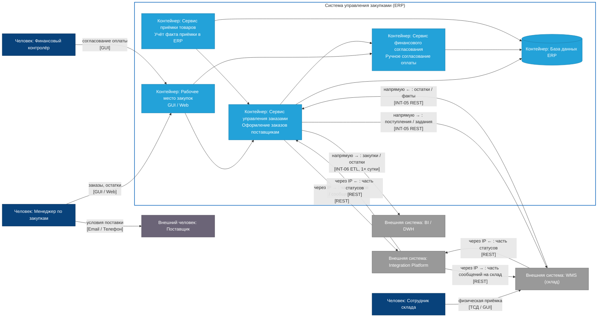

# C4: контейнеры (AS-IS) — Система управления закупками (ERP)

| Поле | Значение |
| --- | --- |
| Уровень | Контейнеры (**AS-IS**) |
| Раскрывает | [Контекст AS-IS](ContextLevel_as-is.md) |
| Источники | ArchiMate as-is, DOC-04, DOC-05, BPMN |
| Сравнение | [Containers TO-BE](Containers_to-be.md) |

## Диаграмма

## Замечания AS-IS

- Нет контейнеров **прогнозирования** и **авто-согласования** (PR-01, PR-02, PR-11).
- Нет **систем поставщиков** — только Person (Email / Телефон).
- Есть **сотрудник склада** → WMS.
- **Смешанные** интеграции: часть через IP, часть **напрямую** ERP↔WMS (INT-05), ERP→BI (INT-06).
