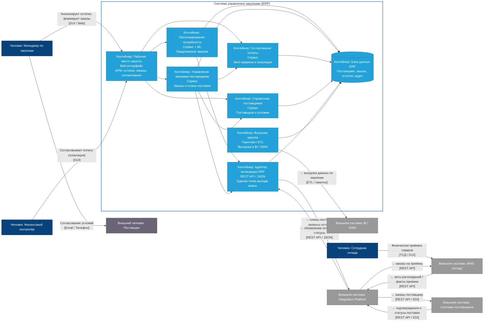

# C4: контейнеры (TO-BE) — Система управления закупками (ERP)

| Поле | Значение |
| --- | --- |
| Уровень | Контейнеры (**TO-BE**) |
| Раскрывает | [Контекст TO-BE](ContextLevel_to-be.md) |
| Сравнение | [Containers AS-IS](Containers_as-is.md) |

## Диаграмма

## Что появилось относительно AS-IS

| AS-IS | TO-BE |
| --- | --- |
| Нет прогноза | Прогнозирование потребности (ML) |
| Только ручное согласование | Авто-правила + эскалация |
| Нет адаптера / смешанные связи | Адаптер → только через IP |
| Нет систем поставщиков | Системы поставщиков ↔ IP |
| Прямая ERP↔WMS (часть потоков) | Только IP ↔ WMS |
