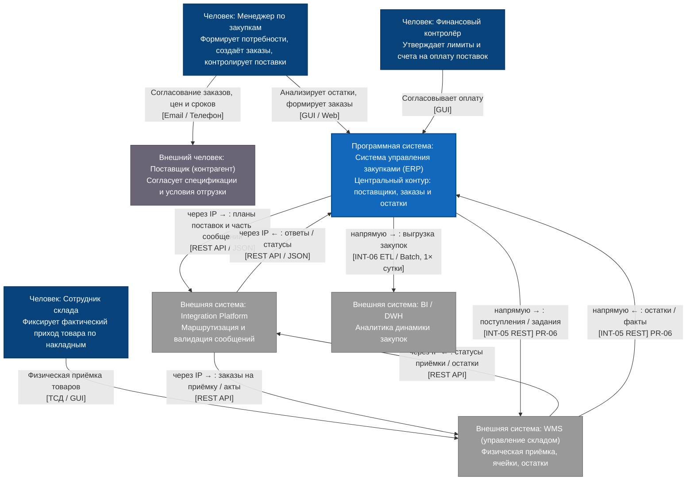

# C4: контекст (AS-IS) — Система управления закупками (ERP)

| Поле | Значение |
| --- | --- |
| Уровень | Контекст (**AS-IS**) |
| Система в фокусе | Система управления закупками (ERP) |
| Источник | [c4 context.png](c4%20context.png), DOC-04, DOC-05, BP-02 |

## Почему это AS-IS

- **Integration Platform уже есть** (IS-07), но по DOC-05 **не все** обмены идут через неё.
- **Системы поставщика нет**: поставщик — **Person**, связь с менеджером **[Email / Телефон]**.
- Сотрудник склада работает в **WMS**, не в ERP.

## Какие потоки через IP, какие напрямую (DOC-05)

| Поток | Как в AS-IS | Основание |
| --- | --- | --- |
| ERP ↔ Integration Platform ↔ WMS (планы поставок / часть складских сообщений) | **через IP** | схема на `c4 context.png` |
| ERP ↔ WMS (поступления, остатки — INT-05) | **напрямую** (часть связей) | DOC-05 INT-05; PR-06 |
| ERP → BI / DWH (закупки, остатки — INT-06) | **напрямую** ETL раз в сутки | DOC-05 INT-06 |
| Менеджер ↔ Поставщик | **вне ИС** (Email / Телефон) | `c4 context.png` |

## Диаграмма

## Граница

В фокусе **ERP (закупки)**. Integration Platform есть, но AS-IS смешанный: часть потоков через IP, часть напрямую (ERP↔WMS, ERP→BI). Поставщик вне ИС.

См. также: [Context TO-BE](ContextLevel_to-be.md) · [Containers AS-IS](Containers_as-is.md) · [Containers TO-BE](Containers_to-be.md).
