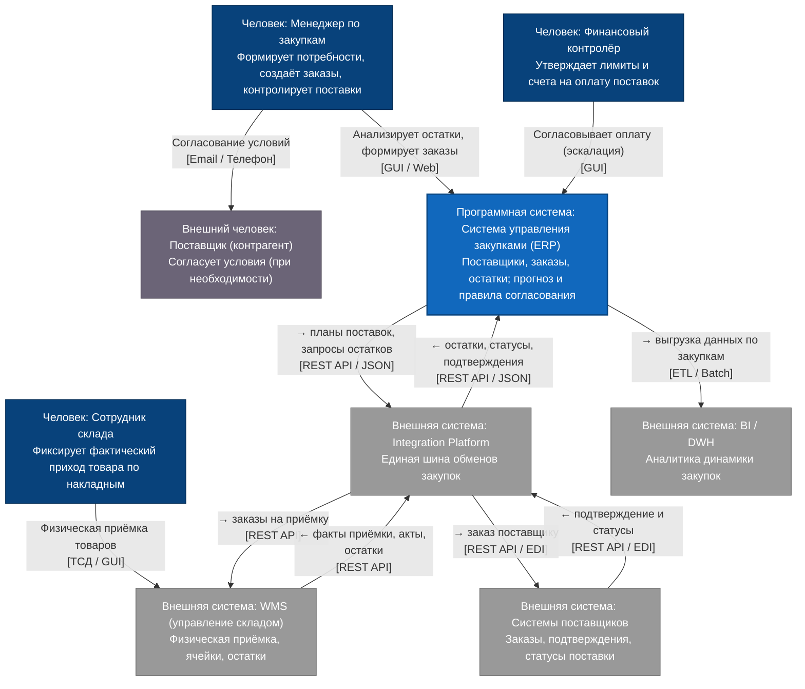

# C4: контекст (TO-BE) — Система управления закупками (ERP)

| Поле | Значение |
| --- | --- |
| Уровень | Контекст (**TO-BE**) |
| Система в фокусе | Система управления закупками (ERP) |
| Опирается на | [Context AS-IS](ContextLevel_as-is.md), REQ-AA-04, паспорт домена |

## Что меняется относительно AS-IS

- Все **новые и межсистемные** обмены закупок — **только через Integration Platform** (нет прямой ERP↔WMS).
- Появляются **системы поставщиков** (внешние ИС) ↔ IP.
- Поставщик как **Person** может остаться для переговоров (Email / Телефон); электронный обмен заказами/статусами — через системы поставщиков.
- Внутри ERP (не на Context) появляются прогноз и авто-согласование — см. [Containers TO-BE](Containers_to-be.md).

## Диаграмма

## Граница

Прямой связи **ERP ↔ WMS нет**. Обмены с WMS и системами поставщиков — через **Integration Platform**. Детализация ERP — [Containers TO-BE](Containers_to-be.md).
