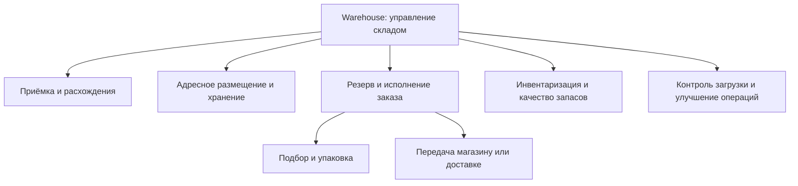

# Архитектурное видение и бизнес-возможности Warehouse

| Поле | Значение |
| --- | --- |
| Идентификатор / версия | WH-VIS-001 / 1.0 |
| Дата | 04.10.2026 |
| Ответственная группа | Команда 3 — Warehouse |
| Статус | Проект для согласования; не свидетельствует о внедрении |
| Источники | [DOC-01](../../../00_Documentation/DOC-01.md), [DOC-03](../../../00_Documentation/DOC-03.md), [DOC-08](../../../00_Documentation/DOC-08.md), [DOC-09](../../../00_Documentation/DOC-09.md), [DOC-10](../../../00_Documentation/DOC-10.md), [DOC-12](../../../00_Documentation/DOC-12.md), [DOC-13](../../../00_Documentation/DOC-13.md), [DOC-17](../../../00_Documentation/DOC-17.md) |
| Связанные требования | WH-R-01–20 — [каталог](../Requirements/WH-REQ-001-requirements.md) |

## Область и целевое состояние

Команда 3 проектирует BP-03 от приёмки поставки до передачи собранного товара магазину или доставке, включая хранение, инвентаризацию и обмен данными. Складской остаток распределительного склада и выполнение складского задания принадлежат Warehouse. Закупочные решения, оплата и жизненный цикл клиентского заказа остаются у смежных команд. Основной эффект — достоверное обещание наличия и предсказуемая отгрузка.

В To-Be сохраняются WMS и ERP. Склад регистрирует операции и резерв в WMS; обновления передаются через Integration Platform; подтверждение резерва происходит у источника данных, а не по копии витрины. Комплектация получает правила размещения и маршрутизации. Отказ аналитики или ИИ не останавливает склад. Это проектный вариант; возможность расширения установленной WMS проверяется до выбора реализации.

## Карта бизнес-возможностей

| Возможность | As-Is по источникам | Развитие To-Be | Требования |
| --- | --- | --- | --- |
| Приёмка | Поддерживается WMS; есть ручные операции | Сверка ожидаемого/фактического, регистрируемое исключение | WH-R-04/09 |
| Размещение | Ручное распределение, оптимизация отсутствует | Правила допустимых ячеек и предложение места | WH-R-06 |
| Резерв | D-06 содержит резерв; алгоритм не описан | Единое атомарное подтверждение доступности | WH-R-01/03 |
| Комплектация | Маршруты не оптимизируются | Формальное задание, предложенный маршрут, контроль статусов | WH-R-05/06 |
| Инвентаризация | Функция WMS; есть расхождения | Снимок/контроль движений, проверяемая корректировка | WH-R-04/14 |
| Аналитика | Суточная актуализация данных BI | События, измерение этапов и свежести | WH-R-08/13 |

## Связь со стратегией и критерии успеха

Значения DOC-08 относятся к компании; предлагаемые складские метрики требуют базового замера. Оценка стратегии выполнена по логической связи решения с целью, не по фактическому бизнес-эффекту.

| Цель DOC-08 | Вклад Warehouse | Критерий успеха / метод | Связь |
| --- | --- | --- | --- |
| Качество обслуживания | Подтверждённый резерв и достоверный статус | При конкурентном запросе последней единицы резерв получает только один заказ; нет двойного списания при повторе | WH-G-01; WH-R-03/09 |
| Развитие онлайн-продаж | Быстрая комплектация и устойчивость к пикам | Совместный замер цикла заказа ≤10 минут; отдельно измеряется складская доля. Доступность сайта 99,9% не становится автоматически SLA WMS | WH-G-02/03; WH-R-07/08/12 |
| Эффективность внутренних процессов | Правила размещения и подбора, снижение ручного ввода | Сравнить одинаковые профили заказов до/после; принять доменную долю корпоративного снижения ручных операций ≥40% после замера | WH-R-04/06/08 |
| Качество аналитики | Проверяемые движения и история | Сводный отчёт компании ≤15 минут по DOC-08; оперативный отчёт ≤1 минуты по DOC-17. Свежесть данных оценивается отдельно | WH-R-13/20 |
| Развитие архитектуры | Единые контракты и воспроизводимый выпуск | Новая функция компании ≤1 недели — совместная цель. Warehouse проверяет совместимость API и собственный цикл выпуска | WH-G-04; WH-R-17/18 |

## Принципы применительно к складу

| Общий принцип DOC-08/13 | Следствие для Warehouse | Проверка решения |
| --- | --- | --- |
| Бизнес прежде технологии | Приоритет достоверности и исполнения | У каждого компонента есть проблема и измеримый эффект |
| Единственный источник данных | WMS — физический остаток склада; ERP — товар и учёт | Нет второго независимого писателя остатка |
| API First и слабая связанность | Версионированные API и события через платформу | Контракты описаны до реализации; нет нового прямого обмена с соседями |
| Повторное использование | Сначала расширить WMS и платформу | Новый сервис обосновывается отсутствием возможностей и стоимостью |
| Автоматизация | Автоматизировать повторяемое, сохранять контроль исключений | Приёмка, ошибка обмена, выпуск версии проверяются сценариями |
| Security by Design | Роли, защищённые каналы, аудит | Проверки запрета доступа и прослеживаемость корректировки |
| Cloud Ready | Новые компоненты переносимы и масштабируемы | Нет обязательной миграции ERP или покупки облака |
| Наблюдаемость | Видно состояние заказа и задержку обмена | Сквозной идентификатор связывает операцию с ошибкой |

## Оценка согласованности

Выбранный вариант поддерживает все пять стратегических целей; основной эффект Warehouse относится к наличию и исполнению. Полный клиентский профиль, рекомендации покупателю и бонусы не создаются внутри склада. Цели не гарантируются одной технологией: требуются [план измерений](../../04_Technology_Architecture/Monitoring/WH-OPS-001-operations.md), [междоменные соглашения](../../07_Project_Management/WH-PM-002-coordination.md) и [экономическая проверка](../../07_Project_Management/TCO_ROI/WH-ECO-001-business-case.md).

[К содержанию Warehouse](../../README.md)
