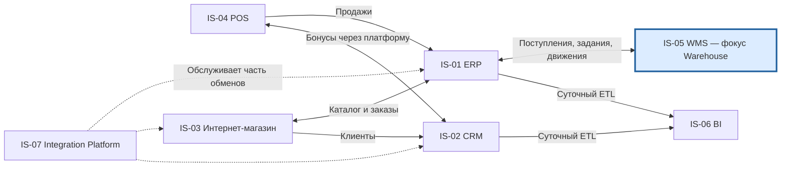

# Карта приложений и границы ответственности

| Поле | Значение |
| --- | --- |
| Идентификатор / версия | WH-APP-001 / 1.0 |
| Дата | 04.10.2026 |
| Ответственная группа | Команда 3 — Warehouse |
| Статус | Проект для согласования; не свидетельствует о внедрении |
| Источники | [DOC-04](../../../00_Documentation/DOC-04.md), [DOC-05](../../../00_Documentation/DOC-05.md), [DOC-06](../../../00_Documentation/DOC-06.md), [DOC-07](../../../00_Documentation/DOC-07.md), [DOC-09](../../../00_Documentation/DOC-09.md), [DOC-16](../../../00_Documentation/DOC-16.md) |
| Связанные требования | WH-R-01/02/05/17/18 — [каталог](../../01_Business_Architecture/Requirements/WH-REQ-001-requirements.md) |

## Application Landscape As-Is

Это обзор семи систем предприятия с выделением контекста Warehouse по DOC-04/05. Соседние домены показаны как зависимости; документ не изменяет их архитектуру. Стрелки отражают логические обмены, а не физическое размещение.

В DOC-16 описан дополнительный поток WMS → интернет-магазин и другой обмен ERP → WMS. Они не добавлены в этот базовый граф как бесспорные факты; альтернативы отражены в [интеграциях](../Integrations/WH-INT-001-integration.md). Точные маршруты всех связей через платформу не установлены.

## Системы, владельцы и функции

| Код / система | Бизнес-владелец по DOC-04 | Основные функции | Граница относительно Warehouse | Техническое сопровождение |
| --- | --- | --- | --- | --- |
| IS-01 ERP | Финансовый директор | Товары, закупки, поставщики, заказы, финансовый и товарный учёт | Источник товара, ожидаемой поставки и учётного заказа; потребитель фактов склада. Не управляет ячейками | ИТ-отдел |
| IS-02 CRM | Директор по маркетингу | Клиенты, лояльность, бонусы, кампании | Не входит в складской контур; полная карточка клиента складу не нужна | ИТ-отдел |
| IS-03 Интернет-магазин | Руководитель интернет-магазина | Витрина, корзина, заказ, оплата, статус | Создаёт клиентский заказ; запрашивает доступность и резерв через платформу; не изменяет физический остаток | ИТ-отдел |
| IS-04 POS | Коммерческий директор | Продажа, чек, оплата, возврат, скидки | Продажа в магазине не должна списывать тот же товар с распределительного склада повторно | ИТ-отдел |
| IS-05 WMS | Директор по логистике | Приёмка, размещение, хранение, комплектация, инвентаризация, отгрузка | Единственный исполнитель складского движения и авторитетный остаток распределительного склада | ИТ-отдел |
| IS-06 BI | Финансовый директор | Отчёты и анализ продаж, закупок, клиентов | Читает историю и агрегаты, не исправляет остатки WMS | ИТ-отдел |
| IS-07 Integration Platform | ИТ-директор | Маршрутизация, преобразование, API, журналирование | Передаёт команды и события, не решает бизнес-правила резерва | ИТ-отдел |

Владелец приложения отличается от владельца данных: финансовый директор владеет ERP как системой, коммерческий отдел — карточкой товара, логистика — складским остатком. Коды IS относятся к приложениям; APP-04 из DOC-07 — сервер WMS.

## Варианты модернизации

| Вариант | Что меняется | Преимущества | Ограничения | Вывод |
| --- | --- | --- | --- | --- |
| A. Точечная доработка существующих обменов | Добавить проверки и ручные сверки | Низкая начальная сложность | Сохраняет сильную связанность и сложность развития | Только как переходный этап |
| B. Развитие WMS и единого интеграционного контура | Формализовать API, резерв, события; добавить адаптер и правила подбора | Сохраняет системы, устраняет причины ошибок; допускает поэтапный переход | Требуются поддерживаемые механизмы расширения WMS | Предлагаемый основной вариант |
| C. Полная замена WMS и отдельные микросервисы для всех операций | Перепроектировать исполнение склада | Больше свободы в долгосрочном развитии | Высокий риск миграции, обучения и стоимости; нарушает ориентацию на сохранение систем | Отклонён для текущего объёма |

Вариант B включает новые самостоятельные интеграционные компоненты; логические сервисы внутри WMS не обязательно развёртываются независимо. [Каталог сервисов](../Services/WH-SRV-001-services.md), [ArchiMate Application Layer](../../06_Architecture_Models/ArchiMate/WH-AM-001-layered-model.md), [C4 Context](../../06_Architecture_Models/C4/WH-C4-001-context.md), [C4 Container](../../06_Architecture_Models/C4/WH-C4-002-containers.md) раскрывают один согласованный вариант.

[К содержанию Warehouse](../../README.md)
