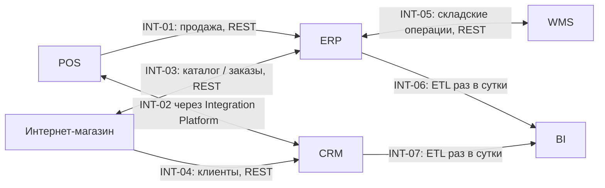
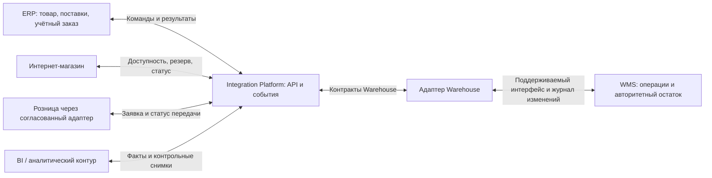

# Интеграционная архитектура As-Is и To-Be

| Поле | Значение |
| --- | --- |
| Идентификатор / версия | WH-INT-001 / 1.0 |
| Дата | 04.10.2026 |
| Ответственная группа | Команда 3 — Warehouse |
| Статус | Проект для согласования; не свидетельствует о внедрении |
| Источники | [DOC-04](../../../00_Documentation/DOC-04.md), [DOC-05](../../../00_Documentation/DOC-05.md), [DOC-06](../../../00_Documentation/DOC-06.md), [DOC-16](../../../00_Documentation/DOC-16.md) |
| Связанные требования | WH-R-01/02/03/09/13/15 — [каталог](../../01_Business_Architecture/Requirements/WH-REQ-001-requirements.md) |

## As-Is: подтверждённая основа DOC-05

| Связь с Warehouse | Источник → потребитель | Объекты / периодичность | Недостаток |
| --- | --- | --- | --- |
| DOC-05 INT-05 | ERP ↔ WMS | Поступления, остатки, задания, отгрузки; REST почти в реальном времени | Ошибки синхронизации вызывают расхождения |
| DOC-05 INT-03 | ERP ↔ интернет-магазин | Каталог каждые 15 минут; заказы сразу | Риск продажи отсутствующего товара; 15 минут прямо указаны для каталога, не для всех складских событий |
| DOC-05 INT-06 | ERP → BI | В том числе остатки; суточный ETL | Устаревшие данные отчётности |
| DOC-16 INT-003, альтернативное описание | ERP → WMS | Товар, категория, единица измерения; файлы по расписанию | Неоперативная загрузка и ручной контроль |
| DOC-16 INT-004, дополнительное описание | WMS → интернет-магазин | Доступность и склад; API и периодические загрузки | Нет событийного обновления |

Последние две строки требуют инвентаризации; источники могут описывать разные каналы обмена. DOC-16 также отрицает наличие Integration Platform, указанной в DOC-04/05/07. Базовая модель строится по DOC-01–09; спорные утверждения не объединяются в ложную единую схему.

## Недостатки

1. Несогласованные копии остатка и нет подтверждённого общего правила записи — WH-P-01/02.
2. Прямые зависимости, неполный каталог API и отсутствие событийного распространения — WH-P-05.
3. Недостаточные повторная обработка и контроль ошибок; операционные статусы плохо прослеживаются — WH-P-05/06.
4. Суточный аналитический обмен не обеспечивает оперативное управление загрузкой — WH-P-07.
5. Семантика «остаток», «доступно», «заказ обработан» требует формализации — WH-P-08.

## To-Be: все новые межсистемные обмены через платформу

| Поток | Источник данных | Потребитель | Механизм | Ответственность |
| --- | --- | --- | --- | --- |
| Мастер-данные товара | ERP | WMS | Версионированное обновление через платформу | Коммерческий отдел за содержание |
| Ожидаемая поставка | ERP | WMS | Команда/API + подтверждение | Закупки |
| Результат приёмки | WMS | ERP | Событие с идентификатором приёмки и строками | Логистика |
| Доступность и резерв | WMS | ERP/интернет-магазин/согласованный канал | Чтение + синхронное подтверждение записи резерва | Логистика, владелец заказа за отмену |
| Задание | ERP | WMS | Идемпотентная команда | Коммерческий владелец заказа |
| Готовность/передача/отмена | WMS | ERP и заинтересованные каналы | Событие после фиксации факта | Логистика |
| История операций | WMS | BI | Подписка + контрольная сверка | Логистика за факт, аналитика за показатель |

## Ошибки и временная несогласованность

- Изменение запаса и публикация разделены по времени, но связаны устойчивым журналом. Повторы допустимы; двойное бизнес-действие недопустимо.
- Событие содержит eventId, aggregateId, aggregateVersion, occurredAt, correlationId и версию схемы. Потребители применяют порядок в пределах объекта; глобальный порядок для всех SKU не требуется.
- Ошибка валидации переводится в карантин для разбора, временная недоступность — в ограниченные повторы с увеличением интервала. Повторная отправка сохраняет исходный eventId.
- При недоступной WMS нельзя подтвердить новый резерв по старому кешу. Канал сообщает, что наличие ещё не подтверждено. Уже завершённую физическую отгрузку не повторяют из-за отсутствия ответа ERP.
- Плановый снимок на согласованную версию выявляет пропуски. Несовпадение классифицируют как задержку доставки, ошибку преобразования или физическое расхождение; автоматическое «усреднение» остатков запрещено.

См. [каталог API](../APIs/WH-API-001-catalog.md), [владение данными](../../03_Data_Architecture/Data_Ownership/WH-DGO-001-ownership.md), [C4 Container](../../06_Architecture_Models/C4/WH-C4-002-containers.md), [ADR интеграции](../../05_Architecture_Decisions/ADR/ADR-WH-002-integration.md). Платформа — общий корпоративный ресурс; здесь формулируются требования Warehouse, а не утверждается её изменение за другие команды.

[К содержанию Warehouse](../../README.md)
