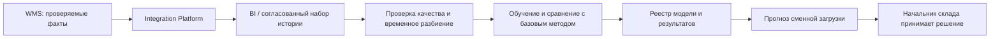

# Варианты применения ИИ в Warehouse

| Поле | Значение |
| --- | --- |
| Идентификатор / версия | WH-AI-001 / 1.0 |
| Дата | 04.10.2026 |
| Ответственная группа | Команда 3 — Warehouse |
| Статус | Проект для согласования; не свидетельствует о внедрении |
| Источники | [DOC-08](../../../00_Documentation/DOC-08.md), [DOC-11](../../../00_Documentation/DOC-11.md), [DOC-12](../../../00_Documentation/DOC-12.md), [DOC-17](../../../00_Documentation/DOC-17.md) |
| Связанные требования | WH-R-06/13/19/20 — [каталог](../../01_Business_Architecture/Requirements/WH-REQ-001-requirements.md) |

## Область

DOC-08 требует предложить направления ИИ, а DOC-11 содержит запрос логистики на прогноз загрузки. Для Warehouse приоритетен прогноз числа и трудоёмкости складских заданий. Прогноз закупочной потребности принадлежит закупкам; склад предоставляет им качественные факты, не создаёт второй центр закупочных решений.

| Вариант | Бизнес-задача и данные | Предлагаемый результат | Пилот и критерии | Ограничения |
| --- | --- | --- | --- | --- |
| AI-WH-01 Прогноз загрузки | История заказов и складских этапов, число строк/габаритная категория, календарь и согласованные акции | Прогноз объёма/трудоёмкости на смену и диапазон неопределённости | Скользящий временной backtest без утечки будущего; сравнение с сезонным наивным прогнозом; MAE/WAPE при ненулевом суммарном спросе и ошибка в пиковые смены | План смен утверждает начальник; модель не резервирует товар и не меняет штат автоматически |
| AI-WH-02 Поиск аномалий | Движения, корректировки, расхождения и задержки обмена | Очередь подозрительных случаев с объясняющими признаками | Сначала правила; затем сравнить precision/recall на размеченных случаях, нагрузку ложных тревог и время разбора | Подозрение не считается доказанной недостачей или виной сотрудника; никаких автоматических списаний |
| AI-WH-03 Помощник по инструкциям | Утверждённые регламенты, справка WMS, инструкции исключений | Ответ сотруднику со ссылкой на актуальный пункт инструкции | Набор контрольных вопросов; доля корректных ссылок, неверных ответов и полезность по оценке пользователей | Только чтение; нет доступа к произвольным данным клиентов и права выполнить операцию |

Автоматическая оптимизация маршрута WH-R-06 не обязательно требует машинного обучения: сначала оцениваются правила адресного хранения и алгоритмы маршрутизации. ИИ не выбирается лишь потому, что он упомянут в стратегии.

## Архитектура пилота AI-WH-01

Нужны версии набора данных и модели, воспроизводимое обучение, контроль ошибки по сезонам, мониторинг деградации и возможность отключить модель. При недоступности прогноза сохраняется обычное планирование; выполнение операций WMS не зависит от ИИ.

## Предлагаемая последовательность

1. Подготовить качественную историю, определить единицу прогнозирования и горизонт со складом.
2. Построить базовый сезонный прогноз и оценить его на отложенном периоде.
3. Испытать более сложную модель только при наличии дополнительного эффекта. Численные пороги качества утверждаются до пилота.
4. Проверить бизнес-эффект на планировании смен без автоматического исполнения рекомендаций.
5. После положительного решения разрешить ограниченную эксплуатацию; AI-WH-02/03 рассматривать отдельно.

Статус всех вариантов — предложения. В [ТЭО](../../07_Project_Management/TCO_ROI/WH-ECO-001-business-case.md) выгоды ИИ не включены в основной сценарий, чтобы не выдать неопределённый эффект за гарантированную экономию. Связь с [безопасностью](../../04_Technology_Architecture/Security/WH-SEC-001-security.md) и WH-R-20.

[К содержанию Warehouse](../../README.md)
