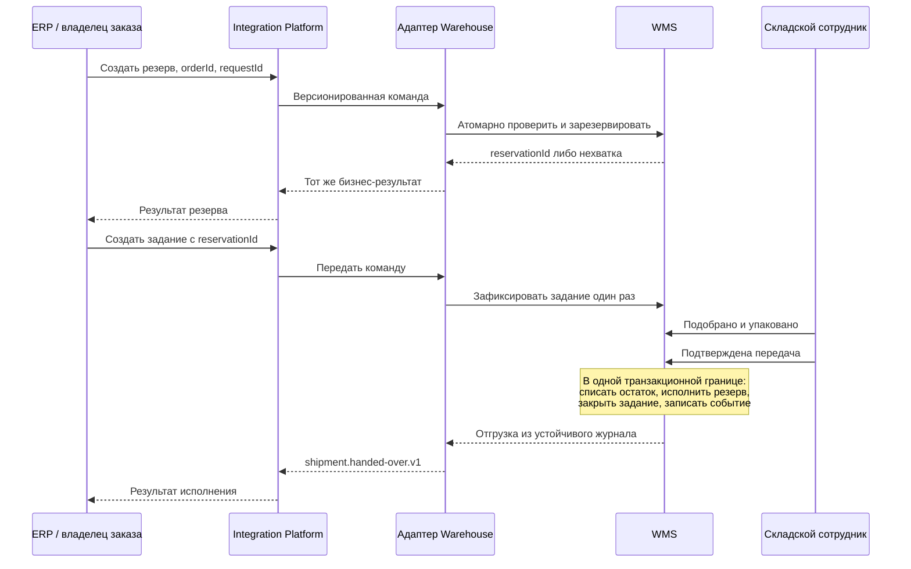

# Каталог сервисов Warehouse

| Поле | Значение |
| --- | --- |
| Идентификатор / версия | WH-SRV-001 / 1.0 |
| Дата | 04.10.2026 |
| Ответственная группа | Команда 3 — Warehouse |
| Статус | Проект для согласования; не свидетельствует о внедрении |
| Источники | [DOC-03](../../../00_Documentation/DOC-03.md), [DOC-04](../../../00_Documentation/DOC-04.md), [DOC-05](../../../00_Documentation/DOC-05.md), [DOC-06](../../../00_Documentation/DOC-06.md), [DOC-15](../../../00_Documentation/DOC-15.md) |
| Связанные требования | WH-R-01/02/03/04/05/09/13 — [каталог](../../01_Business_Architecture/Requirements/WH-REQ-001-requirements.md) |

## Границы сервисов

SRV-05 из DOC-15 «Управление запасами» детализирован ниже для проектирования. Новые WH-SVC-коды являются доменными идентификаторами предложения. Логический сервис не равен отдельному микросервису: WH-SVC-01–04 реализуются штатными функциями/расширением WMS, пока обоснование не докажет необходимость другого решения.

| ID / сервис | Операции и данные | Исполнитель / бизнес-владелец | Потребители | Интерфейсы и требования |
| --- | --- | --- | --- | --- |
| WH-SVC-01 Запасы и резерв | Доступность, создание/освобождение резерва; Stock, Reservation | WMS / логистика | ERP, интернет-магазин, согласованный сценарий розницы | API-01–03; WH-R-01/03 |
| WH-SVC-02 Приёмка и размещение | Ожидаемая поставка, факт приёмки, ячейка, движение | WMS / логистика | Склад, закупки через ERP | API-04–05; WH-R-04/06 |
| WH-SVC-03 Исполнение задания | Создание, сборка, упаковка, исключение, отмена, передача | WMS / логистика | Склад, ERP, каналы продаж, доставка через владельца заказа | API-06–09; WH-R-05 |
| WH-SVC-04 Инвентаризация | Снимок зоны, пересчёт, согласование и корректировка | WMS / логистика | Начальник склада, финансовый учёт ERP | API-10; WH-R-04/14 |
| WH-SVC-05 Складской адаптер | Валидация контрактов, преобразование форматов, ретраи и корреляция | Новый интеграционный компонент / ИТ | Integration Platform и WMS | Все внешние контракты; WH-R-02/09/15 |
| WH-SVC-06 Поставка аналитических данных | Поток фактов операций и снимки для сверки | Адаптер + платформа / логистика за содержание, ИТ за доставку | BI, прогнозирование | API-11 и события; WH-R-08/13/20 |

## Правила взаимодействия

- Внешние команды проходят через Integration Platform, затем адаптер; локальный интерфейс сотрудника обращается к WMS. Адаптер не ведёт собственную бизнес-копию запаса.
- WMS фиксирует результат операции и устойчивое намерение публикации атомарно в поддерживаемом расширении либо предоставляет журнал изменений с восстановимым курсором. Без подтверждения этой возможности нельзя обещать отсутствие потерь событий.
- Пользовательский ответ «успешно» выдаётся после фиксации результата в WMS. Ответ платформы о приёме сообщения сам по себе не подтверждает резерв или отгрузку.
- Одинаковая команда с тем же ключом идемпотентности возвращает прежний результат; другое содержимое под тем же ключом отклоняется. Локальная таблица повторов адаптера не заменяет защиту от повторов в WMS.
- Изменение склада, резерва и задания связывается одной операцией или явно восстанавливаемым процессом. Нельзя списать товар только потому, что сообщение отправлено.
- Получатель событий хранит обработанный eventId и последнюю версию объекта. Пропуск версии вызывает догрузку/сверку; устаревший снимок не перезаписывает новый.

## Последовательность исполнения заказа

Для интернет-магазина раннее резервирование допустимо через тот же WH-SVC-01 с тем же глобальным orderId; ERP использует полученный reservationId, не создаёт второй резерв. После передачи товар учитывается как «в пути» в согласованном учётном контуре до приёмки магазином/доставкой. [Междоменные условия](../../07_Project_Management/WH-PM-002-coordination.md) пока не утверждены соседними командами.

[К содержанию Warehouse](../../README.md)
