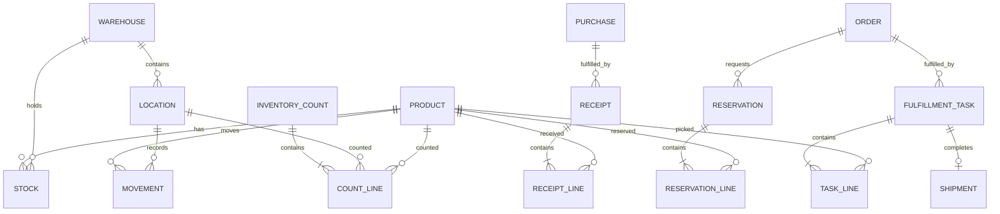
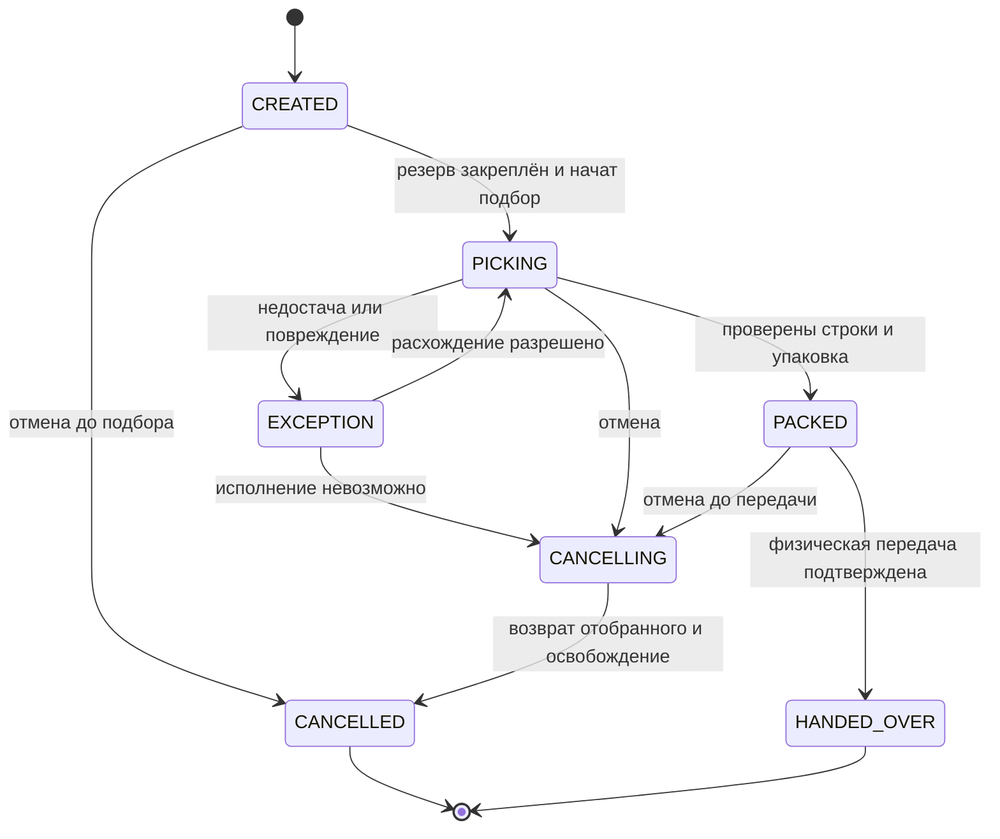

# Концептуальная и целевая модель данных Warehouse

| Поле | Значение |
| --- | --- |
| Идентификатор / версия | WH-DAT-001 / 1.0 |
| Дата | 04.10.2026 |
| Ответственная группа | Команда 3 — Warehouse |
| Статус | Проект для согласования; не свидетельствует о внедрении |
| Источники | [DOC-03](../../../00_Documentation/DOC-03.md), [DOC-04](../../../00_Documentation/DOC-04.md), [DOC-06](../../../00_Documentation/DOC-06.md), [DOC-15](../../../00_Documentation/DOC-15.md) |
| Связанные требования | WH-R-01/03/04/05/09 — [каталог](../../01_Business_Architecture/Requirements/WH-REQ-001-requirements.md) |

## Концептуальная модель

Из DOC-06 непосредственно используются D-01 «Товар», D-03 «Заказ», D-05 «Закупка», D-06 «Остаток». Для D-04 «Поставщик» достаточно ссылки из поставки; полный справочник в WMS не требуется. Клиент, продажа и бонусный счёт остаются внешними сущностями. Ячейка, движение, задание, резерв и документы склада — доменная детализация функций DOC-03/04, а не утверждение о физических таблицах установленной WMS.

В базовом варианте одно складское задание имеет не более одной отгрузки, а частичное исполнение оформляется новым согласованным заданием/версией заказа. У заказа может быть история резервов и заданий, но активные объёмы не дублируются. Кардинальности — проектные ограничения, не описание БД поставщика.

## Целевая логическая модель

| Сущность / ключ | Существенные атрибуты | Связи и ограничения | Источник записи |
| --- | --- | --- | --- |
| Product / productId | sku, name, category, unitCode, status, sourceVersion | Глобальный ID из ERP; артикул не заменяет неизменяемый ID | ERP; WMS хранит разрешённую проекцию |
| Warehouse / warehouseId | name, status | Не смешивать центральный склад и магазины | Корпоративный справочник; владелец логистика, система ведения согласуется |
| Location / locationId | warehouseId, zone, capacity, constraints, status | Принадлежит одному складу; допустимость размещения проверяема | WMS |
| Stock / (warehouseId, productId) | onHand, blocked, reserved, version, asOf | Единственный агрегат доступности SKU на складе; ячеечные балансы суммируются | WMS |
| LocationBalance / (locationId, productId, condition) | quantity, version | Сумма по ячейкам/состояниям согласуется с onHand; staging также физическая зона склада | WMS |
| OrderProjection / orderId | sourceVersion, orderStatus, deliveryMode | Только данные для исполнения, без полного профиля клиента | ERP; статус канала создаётся в онлайн-домене |
| Reservation / reservationId | orderId, warehouseId, state, expiresAt, version | Состояния ACTIVE, ALLOCATED, CONSUMED, RELEASED, EXPIRED; объёмы в ReservationLine | WMS |
| Receipt / receiptId | purchaseId, externalReceiptId, state, receivedAt | Строки: productId, expectedQty, acceptedQty, rejectedQty; каждая фактическая приёмка уникальна | WMS, ожидаемая поставка из ERP |
| FulfillmentTask / taskId | orderId, orderVersion, reservationId, state, assignee, version | Строки: productId, quantity, pickedQty; один активный набор по заказу/версии в базовом варианте | WMS |
| Shipment / shipmentId | taskId, receiverRef, handedOverAt, version | Однократное подтверждение передачи и ссылка на движения | WMS |
| Movement / movementId | operationId, productId, quantity, fromLocationId, toLocationId, type, occurredAt | Неизменяемый факт; исправление компенсирующим движением, а не стиранием | WMS |
| InventoryCount / countId | scope, snapshotVersion, state, approvedBy, reason | Строки: productId, locationId, countedQty, expectedQty; актуальность снимка проверяется | WMS |
| Operation / operationId | clientId, idempotencyKey, requestHash, resultRef | Уникальность (clientId, operationType, key); одинаковый ключ + другое тело — конфликт | WMS/поддерживаемое расширение |
| OutboxEntry / eventId | aggregateId, aggregateVersion, payload, state | Запись с бизнес-изменением в одной транзакции; альтернативно журнал изменений WMS | WMS/поддерживаемое расширение |

Поставщик WMS определяет физическую схему. Это логическая модель целевых правил; создание таблиц напрямую в чужой БД без поддержки продукта не предлагается.

## Инварианты количества

Для агрегата товара на центральном складе предлагается:

`available = onHand − blocked − reserved`, где все величины неотрицательны и `blocked + reserved ≤ onHand`.

`onHand` включает товар в ячейках и в зоне комплектации до физической передачи. `reserved` включает ACTIVE и ALLOCATED, поэтому перенос в зону подбора не высвобождает доступный запас. `blocked` относится только к объёму, который уже не зарезервирован; повреждение зарезервированного товара требует перевода задания в исключение и согласованного пересчёта, не двойного учёта блокировки.

| Операция | Изменение агрегата |
| --- | --- |
| Принято N пригодных единиц | onHand += N; available += N |
| Зарезервировано N | reserved += N; available -= N; onHand не меняется |
| Начат подбор | ACTIVE → ALLOCATED; объём reserved не меняется; истечение срока больше не освобождает автоматически |
| Перемещено в зону упаковки | Меняются ячеечные балансы, складской onHand не меняется |
| Передано N | onHand -= N; reserved -= N; резерв CONSUMED; available по этим единицам не меняется |
| Отменено до подбора | reserved -= N; резерв RELEASED |
| Отмена во время подбора | Сначала физически вернуть/проверить товар; затем освободить reserved; до этого задание CANCELLING |
| Истёк срок до подбора | ACTIVE → EXPIRED, reserved уменьшается однократно |
| Обнаружена недостача | Подтвердить расхождение, проверить связанные резервы и выполнить контролируемую корректировку |

## Состояния задания

Отмена и передача конкурируют по ожидаемой версии задания. Побеждает один переход. HANDED_OVER не переводится в CANCELLED: последующий возврат — новый факт с отдельным согласованием. Инвентаризация выбранной зоны либо блокирует движения, либо учитывает их от снимка до пересчёта; базовое предложение — краткая блокировка конкретной зоны по согласованному графику.

[К содержанию Warehouse](../../README.md)
