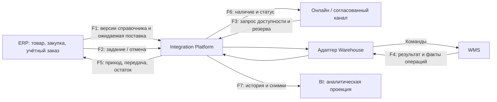

# Потоки данных и правила межсистемного обмена

| Поле | Значение |
| --- | --- |
| Идентификатор / версия | WH-DF-001 / 1.0 |
| Дата | 04.10.2026 |
| Ответственная группа | Команда 3 — Warehouse |
| Статус | Проект для согласования; не свидетельствует о внедрении |
| Источники | [DOC-05](../../../00_Documentation/DOC-05.md), [DOC-06](../../../00_Documentation/DOC-06.md), [DOC-08](../../../00_Documentation/DOC-08.md) |
| Связанные требования | WH-R-01/02/03/09/13/19 — [каталог](../../01_Business_Architecture/Requirements/WH-REQ-001-requirements.md) |

## Диаграмма потоков To-Be

Платформа и адаптер здесь — транспорт/преобразование, не бизнес-хранилище остатка. Системы могут хранить технический журнал для доставки, а BI — аналитическую копию. Ни одна из этих копий не принимает решение о резерве вместо WMS.

| Поток | Когда возникает | Состав данных | Надёжность / контроль |
| --- | --- | --- | --- |
| F1 | Изменение товара, создание/изменение закупки | productId, unitCode, sourceVersion; purchaseId, expectedQty | Ссылочная целостность; неизвестный товар блокирует приёмку соответствующей строки |
| F2 | Заказ готов к складскому исполнению / отменён | orderId, orderVersion, reservationId, строки, requestId | Уникальность задания; конфликт версии возвращается владельцу заказа |
| F3 | Проверка наличия / подтверждение покупки | склад, товар, количество, global orderId | Чтение может быть из проекции; подтверждение только у WMS |
| F4/F5 | Приёмка, резерв, перемещение, передача, коррекция | operationId, movementIds, eventId, версия агрегата | Бизнес-факт и журнал атомарны либо получаются из восстановимого журнала изменений |
| F6 | После изменения резерва/задания/доступности | Только нужные каналу количества и статусы | Дедупликация, запрет регресса версии, asOf |
| F7 | После складской операции + контрольная сверка | Факты и стабильный снимок | Пропуск обнаруживается по версиям; BI не блокирует склад |

## Объектная последовательность

Поступление: закупка ERP → ожидаемая приёмка WMS → физическое подтверждение → движение WMS → остаток WMS → отражение ERP → проекция онлайн/BI.

Исполнение: заказ ERP/канала → один резерв WMS → задание WMS → подбор и упаковка → передача → списание onHand и исполнение резерва → отражение ERP → статусы потребителей.

На передачу в магазин WMS уменьшает только запас центрального склада; товар в пути и приход магазина отражаются отдельными фактами. Продажа через POS не повторяет отгрузку WMS.

## Требования к обмену

Единые идентификаторы и единицы измерения, версии контрактов и объектов, защищённая передача, аутентификация клиента, ограничение данных по назначению, устойчивые повторы, диагностика и сверка обязательны. Все новые межсистемные связи проходят платформу. Устаревшие события не затирают новые проекции. Порядок гарантируется/проверяется по агрегату, а не по всему потоку предприятия.

Сроки свежести, повторов, карантина и хранения согласуют владельцы. Проверки: потеря ответа, дубликат, пропуск, перестановка событий, неизвестный SKU, разная единица, недоступная ERP, восстановление снимка. Подробности: [API](../../02_Application_Architecture/APIs/WH-API-001-catalog.md), [качество данных](../Data_Ownership/WH-DGO-001-ownership.md), [эксплуатация](../../04_Technology_Architecture/Monitoring/WH-OPS-001-operations.md).

[К содержанию Warehouse](../../README.md)
