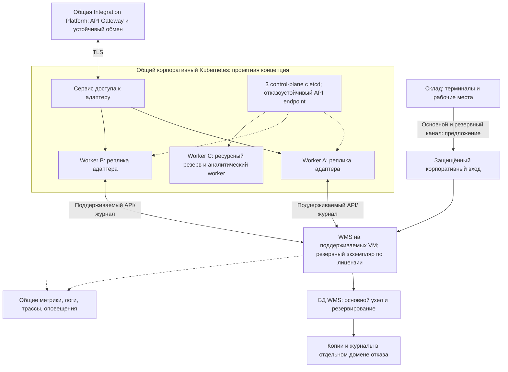

# Технологическая архитектура To-Be и концепция Kubernetes

| Поле | Значение |
| --- | --- |
| Идентификатор / версия | WH-TECH-002 / 1.0 |
| Дата | 04.10.2026 |
| Ответственная группа | Команда 3 — Warehouse |
| Статус | Проект для согласования; не свидетельствует о внедрении |
| Источники | [DOC-07](../../../00_Documentation/DOC-07.md), [DOC-08](../../../00_Documentation/DOC-08.md), [DOC-09](../../../00_Documentation/DOC-09.md), [DOC-12](../../../00_Documentation/DOC-12.md), [DOC-17](../../../00_Documentation/DOC-17.md) |
| Связанные требования | WH-R-07/10/11/12/15/16/18 — [каталог](../../01_Business_Architecture/Requirements/WH-REQ-001-requirements.md) |

## Принятое направление

Сохранить WMS/ERP на поддерживаемой поставщиками инфраструктуре, а новые stateless-компоненты Warehouse размещать в общем корпоративном контейнерном контуре. Целевая схема ниже — проект, который предполагает согласование общей платформы, ресурсов и компетенций ИТ. Отдельный Kubernetes-кластер только для одного адаптера экономически не обоснован.

## Концепция кластера

Для общей платформы предлагаются три control-plane узла со stacked etcd и не менее трёх worker-узлов, распределённых по доступным независимым физическим хостам. Три VM на одном гипервизоре не дают защиты от его отказа. Выбор трёх control-plane согласуется с [официальной рекомендацией Kubernetes для HA stacked topology](https://kubernetes.io/docs/setup/production-environment/tools/kubeadm/ha-topology/). Число worker-узлов — проектное допущение Warehouse для резерва, а не требование источника.

| Аспект | Проектное решение | Проверка |
| --- | --- | --- |
| Доступ к control plane | Отказоустойчивый балансировщик/API endpoint; резервирование его самого | Потеря одного control-plane не лишает возможности управлять кластером |
| Размещение | Не менее двух реплик адаптера на разных worker; резерв мощности для N−1 | Отказ узла сохраняет обслуживание согласованной нагрузки |
| Границы окружений | Отдельные dev/test/prod-контуры; namespace warehouse, квоты и ограничение прав | Тестовая нагрузка не использует данные/секреты production |
| Сеть | Разрешены только нужные маршруты платформы, WMS и наблюдаемости | Запрещён прямой доступ соседнего приложения к БД WMS |
| Масштабирование | По нагрузке/задержке очереди с лимитом параллелизма на WMS/ERP | Увеличение реплик не перегружает неизменяемую WMS |
| Выпуск | Неизменяемые версии образов, проверки готовности, постепенный выпуск и обратимость | Старая и новая версии совместимы по контрактам |
| Stateful-компоненты | WMS/ERP/их БД остаются вне кластера на первом этапе; брокер — ответственность общей платформы | Их HA, копирование и восстановление проверяются отдельно |
| Конфигурация | Версионируемая инфраструктура и конфигурация; секреты вне Git | Воспроизводимое развёртывание тестового контура |

Схема не задаёт CPU/RAM: в документах нет peak requests/s, строк в заказе и характеристик серверов. До закупки выполняются нагрузочный профиль, тесты и capacity plan. Отказоустойчивость Kubernetes не исправляет одиночную БД, канал склада, хранилище, балансировщик или общий отказ серверной.

## Что контейнеризировать

| Компонент | Решение | Причина |
| --- | --- | --- |
| Новый адаптер Warehouse, publisher/consumer | Да; роли могут быть процессами одного образа | Стандартизация выпуска, независимое масштабирование без переноса бизнес-запаса |
| Новый аналитический/прогнозный worker | Да, при одобрении пилота | Изоляция пакетных работ и лимиты ресурсов |
| Оптимизация маршрута | Сначала штатное расширение WMS; отдельный контейнер только при обосновании | Повторное использование, сохранение контроля за заданиями |
| Существующая WMS и ERP | Не переносить автоматически | Совместимость и поддержка поставщика не подтверждены |
| БД WMS, резервное хранение, брокер | Отдельное решение платформенной команды | Нужны требования durability, recovery и компетенции, не только контейнерный запуск |

## Надёжность и режим деградации

Проектная цель доступности WMS — 99,5% из DOC-17, общие верхние пределы RTO 4 часа/RPO 1 час. Месячное окно 24×7 в 30 суток даёт 3 ч 36 мин простоя; один четырёхчасовой сбой нарушит такой SLA. Поэтому предусмотрено быстрое переключение для обычного отказа, а аварийное восстановление проверяется отдельно. Более строгий RPO для подтверждённых физических движений согласует логистика.

Если ERP/платформа недоступны, WMS может продолжать **уже принятые** локальные задания, только если сохраняются права, документы и устойчивый журнал. Новый внешний резерв без WMS не подтверждается. При потере канала склада и отсутствии проверенного offline-режима терминалов физические операции, меняющие запас, приостанавливаются по регламенту; проект не обещает автономность, которой нет в исходниках. Резервный канал снижает этот риск.

## Автоматизация эксплуатации и Cloud Native

Предлагаются контейнерные образы новых сервисов, декларативная конфигурация, CI/CD с контрактными проверками, наблюдаемость и горизонтальное масштабирование. Перенос в публичное облако не обязателен. Минимальный переходный вариант — контейнеры на существующих VM с контролируемым запуском; целевой общий кластер принимается после проверки бюджета и команды эксплуатации. См. [ADR-WH-003](../../05_Architecture_Decisions/ADR/ADR-WH-003-deployment.md), [операционные сценарии](../Monitoring/WH-OPS-001-operations.md) и [план перехода](../../07_Project_Management/Roadmap/WH-ROAD-001-roadmap.md).

[К содержанию Warehouse](../../README.md)
