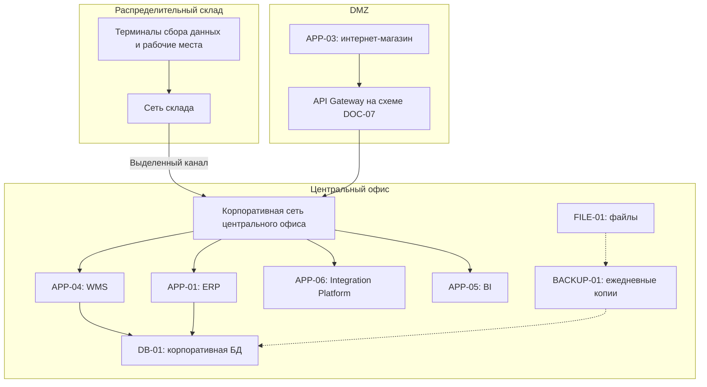

# Технологическая архитектура Warehouse As-Is

| Поле | Значение |
| --- | --- |
| Идентификатор / версия | WH-TECH-001 / 1.0 |
| Дата | 04.10.2026 |
| Ответственная группа | Команда 3 — Warehouse |
| Статус | Проект для согласования; не свидетельствует о внедрении |
| Источники | [DOC-07](../../../00_Documentation/DOC-07.md), [DOC-16](../../../00_Documentation/DOC-16.md), [DOC-17](../../../00_Documentation/DOC-17.md) |
| Связанные требования | WH-R-10/11/12/15/16/18 — [каталог](../../01_Business_Architecture/Requirements/WH-REQ-001-requirements.md) |

## Модель размещения по DOC-07

Это логическая схема на основе описания, а не инвентаризация сетевых портов. Разделение DB-01 на базы WMS/ERP, число гипервизоров и резервирование дисков не указаны. DOC-07 показывает Gateway, DOC-16 отрицает его наличие — вопрос WH-Q-03 остаётся открытым.

## Компоненты и значимые характеристики

| Компонент | Подтверждённое состояние | Значение для Warehouse |
| --- | --- | --- |
| APP-04 WMS и APP-01 ERP | Виртуализированная инфраструктура; приложения разных поставщиков | Требуется проверить поддерживаемые расширения и резервирование |
| APP-06 Integration Platform | Сервер указан в DOC-07 | Есть база для повторного использования, фактический функционал уточняется |
| DB-01 | Корпоративная БД; в компании PostgreSQL и MS SQL Server | Продукт БД WMS не определён; нельзя выбрать способ репликации без уточнения |
| BACKUP-01 и FILE-01 | Ежедневное резервирование; нерегулярная проверка восстановления | Не доказано достижение RPO ≤1 часа |
| Сеть склада | Выделенный канал до центрального офиса | Возможная зависимость смены от канала; резервный канал не описан |
| Терминалы | 25 устройств в корпоративном перечне | Нужно проверить распределение, поддержку сканирования и аутентификации |
| ОС/серверное ПО | Linux, Windows Server; Tomcat, Nginx | Стек конкретной WMS неизвестен |
| Эксплуатация | Ручные развёртывания; мониторинг в основном ресурсов ОС | Нет полного контроля бизнес-операций и задержки обмена |
| Контейнеры/облако | Docker только у разработчиков, Kubernetes отсутствует; бизнес-системы on-premises | Целевая контейнерная архитектура является изменением, не текущим состоянием |

## Ограничения и недостатки

- Единичные точки отказа некоторых сервисов, отсутствие кластеризации и ограниченная балансировка описаны для предприятия; требуется определить, какие именно затрагивают WMS.
- Слабый мониторинг приложений не позволяет обнаружить зависшее задание по одной лишь загрузке CPU.
- Ежедневная копия без проверки восстановления не подтверждает сохранность операций и срок возврата в работу.
- Отсутствуют автоматическое масштабирование и единый процесс выпуска; обновление может затронуть складскую смену.
- Полная замена серверов не входит в проект; требуются поэтапная модернизация и совместимость с существующими приложениями.

[Целевая схема](../Deployment/WH-TECH-002-to-be.md) устраняет эти ограничения проектными мерами. Конкретные мощности, лицензии, RTO/RPO установленной WMS и фактическая топология уточняются перед реализацией.

[К содержанию Warehouse](../../README.md)
