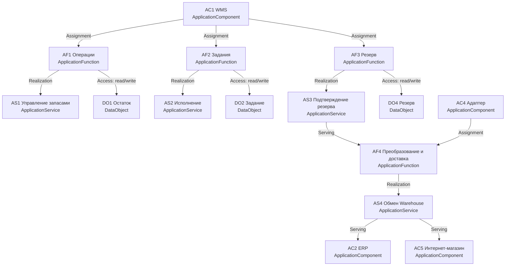
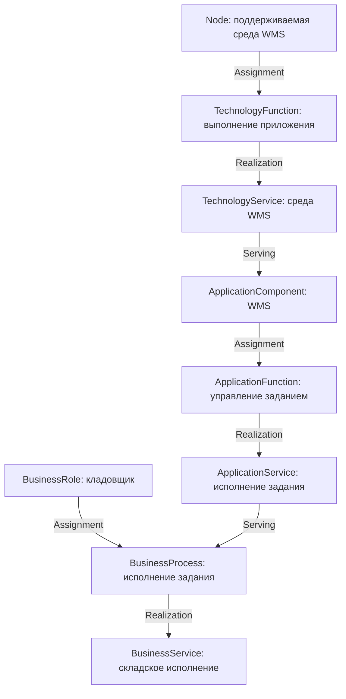

# ArchiMate: связанные бизнес-, прикладной и технологический слои

| Поле | Значение |
| --- | --- |
| Идентификатор / версия | WH-AM-001 / 1.0 |
| Дата | 04.10.2026 |
| Ответственная группа | Команда 3 — Warehouse |
| Статус | Проект для согласования; не свидетельствует о внедрении |
| Источники | [DOC-02](../../../00_Documentation/DOC-02.md), [DOC-03](../../../00_Documentation/DOC-03.md), [DOC-04](../../../00_Documentation/DOC-04.md), [DOC-05](../../../00_Documentation/DOC-05.md), [DOC-06](../../../00_Documentation/DOC-06.md), [DOC-07](../../../00_Documentation/DOC-07.md), [DOC-08](../../../00_Documentation/DOC-08.md), [DOC-09](../../../00_Documentation/DOC-09.md) |
| Связанные требования | WH-R-01/02/03/05/09/17/18 — [каталог](../../01_Business_Architecture/Requirements/WH-REQ-001-requirements.md) |

## Формат и область

Модель описывает Warehouse и его зависимости, используя типы элементов ArchiMate 3.x и явные типы отношений. Таблицы — канонический состав модели; Mermaid даёт читаемое представление в Markdown, без имитации стандартных пиктограмм ArchiMate. Принятый словарь зафиксирован для согласованности с материалами курса, а не как утверждение о новейшей версии стандарта. Справочник типов: [The Open Group, схема модели 3.1](https://www.opengroup.org/xsd/archimate/3.1/html-model/).

[Редактируемая модель ArchiMate в формате Open Exchange](WH-AM-001-model-exchange.xml): 33 элементов, 48 отношений и три представления (Application As-Is, Application To-Be и сквозные слои). Файл проверен по официальной XSD формата 3.1; это проверка структуры файла, а не автоматическое утверждение архитектурных решений. Импортируйте как отдельную модель Warehouse; общий репозиторий ArchiMate не изменялся.

## Элементы

| ID | Тип ArchiMate | Название | Состояние |
| --- | --- | --- | --- |
| BA1 | BusinessActor | Распределительный склад | As-Is/To-Be |
| BR1 | BusinessRole | Кладовщик / комплектовщик | As-Is/To-Be |
| BR2 | BusinessRole | Начальник склада | As-Is/To-Be |
| BP1 | BusinessProcess | Приёмка и размещение | As-Is/To-Be, детали различаются |
| BP2 | BusinessProcess | Комплектация и передача | As-Is/To-Be |
| BP3 | BusinessProcess | Инвентаризация | As-Is/To-Be |
| BS1 | BusinessService | Складское исполнение заказа | As-Is/To-Be |
| AC1 | ApplicationComponent | WMS | As-Is/To-Be |
| AC2 | ApplicationComponent | ERP | As-Is/To-Be, внешний |
| AC3 | ApplicationComponent | Integration Platform | As-Is по DOC-04/05; To-Be развиваемая |
| AC4 | ApplicationComponent | Адаптер Warehouse | To-Be, новый |
| AC5 | ApplicationComponent | Интернет-магазин | Внешний |
| AC6 | ApplicationComponent | BI | Внешний |
| AF1 | ApplicationFunction | Регистрация складских операций | As-Is/To-Be |
| AF2 | ApplicationFunction | Управление заданием | As-Is/To-Be |
| AF3 | ApplicationFunction | Атомарное управление резервом | To-Be: уточнение возможностей WMS |
| AF4 | ApplicationFunction | Преобразование и восстановимая доставка | To-Be |
| AF5 | ApplicationFunction | Ведение товара и учётного заказа | As-Is/To-Be, ERP |
| AS1 | ApplicationService | Управление запасами | As-Is/To-Be; SRV-05 |
| AS2 | ApplicationService | Исполнение складского задания | As-Is/To-Be |
| AS3 | ApplicationService | Подтверждение резерва | To-Be |
| AS4 | ApplicationService | Обмен Warehouse | To-Be |
| AS5 | ApplicationService | Данные товара и заказа | As-Is/To-Be |
| DO1 | DataObject | Складской остаток | As-Is/To-Be |
| DO2 | DataObject | Задание и отгрузка | As-Is/To-Be |
| DO3 | DataObject | Товар и заказ | As-Is/To-Be |
| DO4 | DataObject | Резерв | Поле в As-Is, целевой жизненный цикл |
| N1 | Node | Поддерживаемая среда WMS | As-Is/To-Be |
| N2 | Node | Корпоративный контейнерный контур | To-Be |
| TF1 | TechnologyFunction | Выполнение приложения WMS | As-Is/To-Be |
| TF2 | TechnologyFunction | Выполнение адаптера | To-Be |
| TS1 | TechnologyService | Среда выполнения WMS | As-Is/To-Be |
| TS2 | TechnologyService | Контейнерное выполнение | To-Be |

## Модель Application Layer To-Be

Это отношения предоставления/реализации функций; Serving не обозначает направление передачи пакетов. Физические и логические потоки данных вынесены в [модель потоков](../../03_Data_Architecture/Data_Flows/WH-DF-001-flows.md), поэтому граф сервисов не обходит интеграционную платформу.

## Реестр отношений

| Источник | Отношение | Цель | Смысл |
| --- | --- | --- | --- |
| BA1 | Assignment | BR1, BR2 | Подразделение выполняет роли |
| BR1 | Assignment | BP1, BP2, BP3 | Исполнитель процессов |
| BR2 | Assignment | BP3 | Участие в контроле/утверждении инвентаризации |
| BP2 | Realization | BS1 | Процесс реализует складское исполнение |
| AC1 | Assignment | AF1, AF2, AF3 | WMS выполняет функции |
| AC2 | Assignment | AF5 | ERP ведёт мастер-объекты и учёт |
| AC4 | Assignment | AF4 | Адаптер выполняет преобразование/доставку |
| AF1, AF2, AF3, AF4, AF5 | Realization | AS1, AS2, AS3, AS4, AS5 соответственно | Функции реализуют сервисы |
| AS1 | Serving | BP1, BP3 | Складские операции поддерживают приёмку и инвентаризацию |
| AS2 | Serving | BP2 | Сервис поддерживает исполнение заказа |
| AS3 | Serving | AF2, AF4 | Подтверждение резерва используется заданием и адаптером |
| AS4 | Serving | AC2, AC5, AC6 | Складской обмен обслуживает внешние приложения |
| AS5 | Serving | AF1, AF2 | Товар/заказ нужны складским функциям |
| AF1 | Access (read/write) | DO1 | Изменение физического остатка |
| AF2 | Access (read/write) | DO2 | Изменение задания/отгрузки |
| AF3 | Access (read/write) | DO4, DO1 | Резерв и агрегат доступности |
| AF1, AF2 | Access (read) | DO3 | Склад читает данные ERP |
| AF5 | Access (read/write) | DO3 | ERP изменяет мастер-объекты |
| N1, N2 | Assignment | TF1, TF2 соответственно | Среды выполняют технологическое поведение |
| TF1, TF2 | Realization | TS1, TS2 соответственно | Поведение реализует техническую услугу |
| TS1, TS2 | Serving | AC1, AC4 соответственно | Среды поддерживают WMS/адаптер |
| AC2 | Flow | AC3 | Товар, поставка, задание |
| AC3 | Flow | AC4 | Управляемая доставка команд |
| AC4 | Flow | AC1 | Преобразованные команды |
| AC1 | Flow | AC4 | Подтверждённые складские факты |
| AC4 | Flow | AC3 | События с версиями и идентификаторами |
| AC3 | Flow | AC2, AC5, AC6 | Результаты/события потребителям |

Строка с несколькими целями разворачивается в отдельные отношения одного типа. У объекта DO1 один авторитетный писатель; Access у функций означает работу внутри границы WMS.

## Сквозное представление слоёв

## As-Is и переход

В As-Is подтверждены WMS, ERP, платформа, учёт операций и заданий, складские данные и текущие серверы. Резерв представлен атрибутом D-06, но атомарность и жизненный цикл AF3/AS3 не доказаны. AC4, AF4, AS4 и N2 — целевые добавления. При переходе сначала уточняются возможности AC1/AC3, затем вводятся новые контракты и восстановимая доставка. Цели WH-G-01–04 связаны с функциями через [требования](../../01_Business_Architecture/Requirements/WH-REQ-001-requirements.md); обоснования — [ADR](../../05_Architecture_Decisions/ADR/ADR-WH-001-inventory-authority.md), [ADR интеграции](../../05_Architecture_Decisions/ADR/ADR-WH-002-integration.md), [ADR размещения](../../05_Architecture_Decisions/ADR/ADR-WH-003-deployment.md).

[К содержанию Warehouse](../../README.md)
