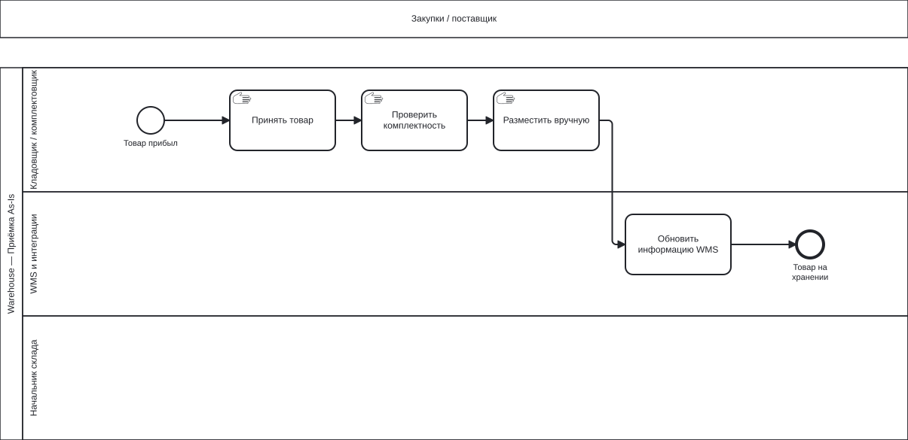
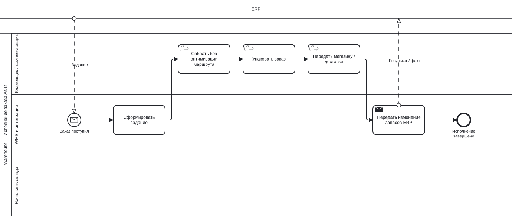

# BPMN: процесс Warehouse As-Is

| Поле | Значение |
| --- | --- |
| Идентификатор / версия | WH-BPMN-001 / 1.0 |
| Дата | 04.10.2026 |
| Ответственная группа | Команда 3 — Warehouse |
| Статус | Проект для согласования; не свидетельствует о внедрении |
| Источники | [DOC-03](../../../00_Documentation/DOC-03.md), [DOC-04](../../../00_Documentation/DOC-04.md), [DOC-05](../../../00_Documentation/DOC-05.md), [DOC-10](../../../00_Documentation/DOC-10.md) |
| Связанные требования | WH-R-04/05/06/08 — [каталог](../../01_Business_Architecture/Requirements/WH-REQ-001-requirements.md) |

## Область и нотация

Модель нормального потока BP-03 построена по DOC-03. Приёмка и комплектация имеют независимые старты: приход поставки не запускает автоматически исполнение конкретного заказа. Дорожки показывают исполнителей, задачи Manual/User/Service различаются; начало и конец — события. В As-Is тип автоматизации «обновить WMS / сформировать задание» не уточнён источником, поэтому использован общий Task, без выдуманной полной автоматизации.

Изображения ниже — стандартная BPMN-графика, построенная из приложенных BPMN 2.0 XML-файлов с диаграммным расположением. Markdown — основной отчёт; `.bpmn` служит редактируемым исходником, `.svg` — его представлением для GitHub. Семантика обозначений: [OMG BPMN 2.0.2](https://www.omg.org/spec/BPMN/2.0.2/).

## Приёмка и размещение

[Исходник BPMN](WH-BPMN-ASIS-receiving.bpmn).

| Шаг | Исполнитель | Основание |
| --- | --- | --- |
| Товар прибыл → принять → проверить комплектность | Кладовщик | DOC-03, шаги 1–3 |
| Разместить вручную | Кладовщик | Шаг 4 и проблема ручного распределения |
| Обновить WMS → товар на хранении | WMS / сотрудник через WMS | Шаг 5; конкретный интерфейс не задан |

## Комплектация и передача

[Исходник BPMN](WH-BPMN-ASIS-fulfillment.bpmn).

| Шаг | Исполнитель | Основание |
| --- | --- | --- |
| Получен заказ → сформировать задание | WMS при поступлении задания от ERP | DOC-03, BP-03 шаг 6 и BP-04 шаги 6–7 |
| Собрать → упаковать → передать | Комплектовщик/кладовщик | BP-03 шаги 7–9 |
| Передать изменение запасов ERP | WMS и обмен | BP-03 шаг 10; DOC-05 INT-05 |

Сплошные стрелки в пуле — Sequence Flow. Пунктирные стрелки между Warehouse и внешним участником — Message Flow с информацией; физическое перемещение товара не обозначено сообщением. Поставщик/ERP показан внешним пулом, внутренние действия соседнего домена не моделируются.

## Ограничения As-Is

DOC-03 не описывает обработку недостачи, отмены и порядок согласования приёмочных расхождений; они не добавлены в As-Is как факты. Инвентаризация известна как функция WMS (DOC-04), её частота задана DOC-10, но детальный текущий регламент отсутствует. Целевой процесс инвентаризации и исключения представлены в [To-Be](WH-BPMN-002-to-be.md). Дорожка начальника склада оставлена для роли из DOC-03; конкретные действия в нормальном потоке источником не заданы.

Наблюдаемые проблемы связаны с шагами: ручное размещение — WH-P-03; подбор без оптимизации — WH-P-04; передача изменений ERP — WH-P-01/05. [Паспорт процесса](../../01_Business_Architecture/Business_Process/WH-BP-001-process.md) содержит входы, выходы и события.

[К содержанию Warehouse](../../README.md)
