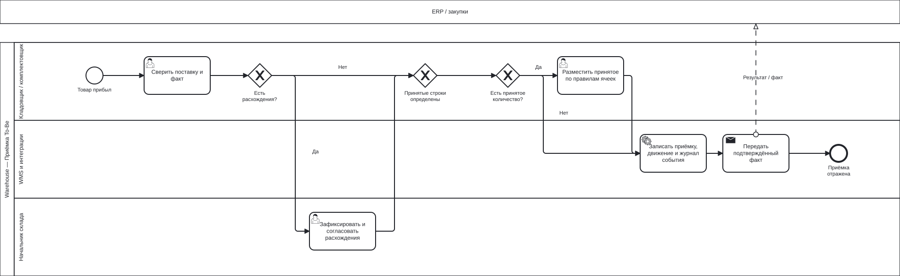
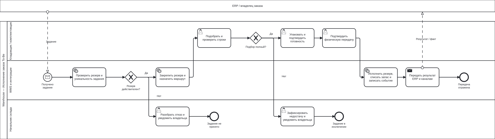
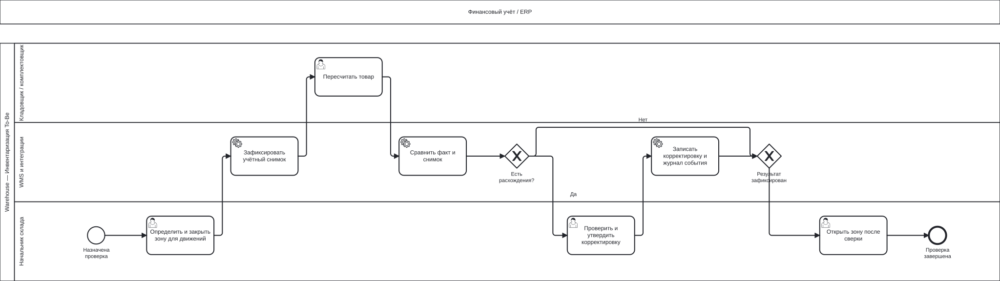

# BPMN: целевые процессы Warehouse

| Поле | Значение |
| --- | --- |
| Идентификатор / версия | WH-BPMN-002 / 1.0 |
| Дата | 04.10.2026 |
| Ответственная группа | Команда 3 — Warehouse |
| Статус | Проект для согласования; не свидетельствует о внедрении |
| Источники | [DOC-03](../../../00_Documentation/DOC-03.md), [DOC-04](../../../00_Documentation/DOC-04.md), [DOC-05](../../../00_Documentation/DOC-05.md), [DOC-06](../../../00_Documentation/DOC-06.md), [DOC-08](../../../00_Documentation/DOC-08.md) |
| Связанные требования | WH-R-03/04/05/06/09/14 — [каталог](../../01_Business_Architecture/Requirements/WH-REQ-001-requirements.md) |

## Проектные правила

Модели представляют предлагаемый To-Be для BP-03. Количества, права, статусы и повторы определяются [моделью данных](../../03_Data_Architecture/Data_Entities/WH-DAT-001-data-model.md) и [контрактами](../../02_Application_Architecture/APIs/WH-API-001-catalog.md). Задачи Service выполняет WMS/поддерживаемое расширение, User — сотрудник в системе. XOR-шлюз выбирает одну ветку; условия веток исключают друг друга. Внешние информационные обмены показаны сообщениями между пулами.

## Приёмка: сверка, исключения, размещение и регистрация

[Исходник BPMN](WH-BPMN-TOBE-receiving.bpmn).

Ожидаемая поставка загружается из ERP до приёмки. При расхождении начальник склада определяет принятые/отклонённые строки и основание. На хранение направляется только принятое количество. Если всё отклонено, ветка «Нет» обходит размещение; факт отказа сохраняется без увеличения запаса. Положительный факт регистрации, движения и намерение публикации фиксируются совместно. Событие содержит результат для ERP; успешная отправка не означает, что потребитель уже выполнил учётную проводку.

## Исполнение: подтверждённый резерв и контроль результата

[Исходник BPMN](WH-BPMN-TOBE-fulfillment.bpmn).

До создания задания вызывается единый механизм резерва. Модель начинается с получения задания с reservationId: проверяется его связь с заказом и уникальность. Действительный резерв закрепляется на время подбора. При недостаче задание переводится в EXCEPTION и текущий экземпляр обработки заканчивается; бизнес-заказ не объявляется исполненным. После расследования возможны новая попытка того же задания по контролируемой версии либо отмена, как определено в жизненном цикле.

Физическая передача и её регистрация должны выполняться как одна контролируемая рабочая процедура. В модели они разделены на User Task и Service Task для распределения ответственности; при технической ошибке после физической передачи сотрудник не передаёт товар второй раз, а оформляет восстановление подтверждения. Изменение onHand/reserved, финального статуса и запись события имеют одну транзакционную границу.

## Инвентаризация: локальная блокировка и утверждение

[Исходник BPMN](WH-BPMN-TOBE-count.bpmn).

Проверка запускается по плану или решению начальника. На время пересчёта блокируется выбранная зона, а не весь бизнес; новые задания не направляются в неё. Неутверждённая корректировка остаётся на разборе, зона не открывается как будто проверка завершена. При отказе в утверждении выполняется повторный пересчёт/разбор до повторного прохождения задачи утверждения; эта задача является составной управленческой процедурой. Факт корректировки доставляется ERP через общий журнал/платформу, как и другие движения.

## Исключения и дополнительные переходы

| Событие | Точка контроля | Действие | Результат |
| --- | --- | --- | --- |
| Повтор входного задания | До формирования/подбора | Вернуть ранее созданный taskId | Второй экземпляр не создаёт второй подбор |
| Отмена до подбора | CREATED | Завершить задание, освободить резерв один раз | CANCELLED |
| Отмена при подборе/упаковке | PICKING/PACKED | CANCELLING, возврат отобранного, проверка и освобождение | CANCELLED после физического возврата |
| Отмена одновременно с передачей | Проверка expectedVersion | Принять один допустимый переход | После HANDED_OVER — отдельный процесс возврата |
| Сбой после commit WMS | Publisher | Восстановить доставку из журнала | Физическую операцию не повторять |
| Невозможность подтвердить резерв | Начало исполнения | Сообщить владельцу заказа причину | Нет ложного обещания наличия |

Полный автомат состояний отмены приведён в [модели данных](../../03_Data_Architecture/Data_Entities/WH-DAT-001-data-model.md); диаграмма BPMN исполнения показывает нормальную ветку и основные исходы, а таблица задаёт дополнительные событийные правила. Возврат после передачи и изменение клиентского обещания находятся вне Warehouse. Проверка модели выполняется по QA-01–14 в [сценариях приёмки](../../04_Technology_Architecture/Monitoring/WH-OPS-001-operations.md).

[К содержанию Warehouse](../../README.md)
