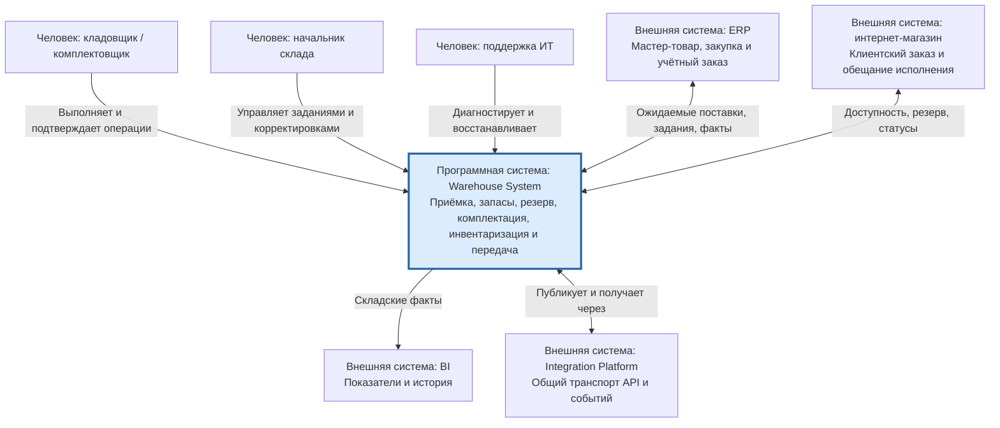

# C4: контекст складской информационной системы

| Поле | Значение |
| --- | --- |
| Идентификатор / версия | WH-C4-001 / 1.0 |
| Дата | 04.10.2026 |
| Ответственная группа | Команда 3 — Warehouse |
| Статус | Проект для согласования; не свидетельствует о внедрении |
| Источники | [DOC-03](../../../00_Documentation/DOC-03.md), [DOC-04](../../../00_Documentation/DOC-04.md), [DOC-05](../../../00_Documentation/DOC-05.md), [DOC-09](../../../00_Documentation/DOC-09.md) |
| Связанные требования | WH-R-01/02/05/17 — [каталог](../../01_Business_Architecture/Requirements/WH-REQ-001-requirements.md) |

## Граница и обозначения

Целевая программная система **Warehouse System** включает WMS с поддерживаемыми расширениями и складской адаптер. Это граница архитектурного рассмотрения команды, а не название нового продукта, заменяющего WMS. Внешние системы показаны без внутреннего устройства. На уровне контекста стрелки означают бизнес-взаимодействие; все новые межсистемные потоки технически проходят Integration Platform, что раскрыто на уровне контейнеров.

Получатели товара — магазин и служба доставки — бизнес-участники, но отдельная их информационная система в DOC-01–09 не задана. Они представлены в [процессе](../../01_Business_Architecture/Business_Process/WH-BP-001-process.md); интеграционное уведомление идёт через согласованного владельца заказа. CRM не включена как прямая зависимость: склад не обслуживает лояльность и полный профиль клиента. POS взаимодействует со складом через согласованный контур ERP/платформы, а не пишет остаток WMS напрямую.

C4 различает уровни систем и контейнеров; технологические протоколы и развёртывание раскрыты в [C4 Container](WH-C4-002-containers.md) и [технологической модели](../../04_Technology_Architecture/Deployment/WH-TECH-002-to-be.md). Методическая основа: [C4 model](https://c4model.com/diagrams/container).

[К содержанию Warehouse](../../README.md)
