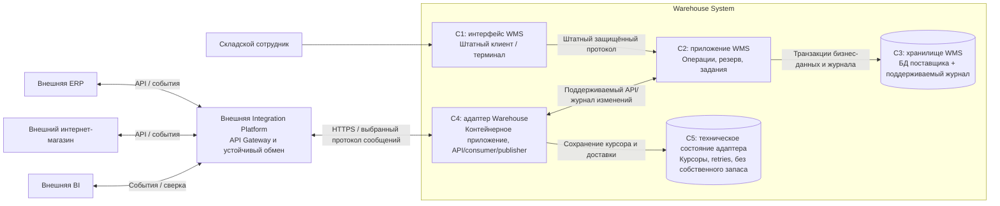

# C4: контейнеры Warehouse System и взаимодействие сервисов

| Поле | Значение |
| --- | --- |
| Идентификатор / версия | WH-C4-002 / 1.0 |
| Дата | 04.10.2026 |
| Ответственная группа | Команда 3 — Warehouse |
| Статус | Проект для согласования; не свидетельствует о внедрении |
| Источники | [DOC-04](../../../00_Documentation/DOC-04.md), [DOC-05](../../../00_Documentation/DOC-05.md), [DOC-07](../../../00_Documentation/DOC-07.md), [DOC-09](../../../00_Documentation/DOC-09.md) |
| Связанные требования | WH-R-01/02/03/09/17/18 — [каталог](../../01_Business_Architecture/Requirements/WH-REQ-001-requirements.md) |

## Область и условности

Модель To-Be раскрывает одну Warehouse System из [контекста](WH-C4-001-context.md). Контейнер C4 — приложение или хранилище, а не обязательно Docker-контейнер. Внутреннее разделение интерфейса, логики и БД установленной WMS необходимо подтвердить у поставщика; ниже это логическая декомпозиция целевой ответственности, не результат анализа исходного кода WMS.

| Контейнер | Ответственность | Данные / технологическое решение |
| --- | --- | --- |
| C1 Интерфейс WMS | Ввод и подтверждение факта сотрудником, просмотр задания | Использовать существующий клиент/ТСД; не хранит второй авторитетный запас |
| C2 Приложение WMS | WH-SVC-01–04; конкурентные переходы, роли, движение и резерв | Поддерживаемое расширение; язык/платформа неизвестны |
| C3 Хранилище WMS | Stock, Reservation, Task, Movement, аудит, устойчивая публикация | БД поставщика; продукт и схема не выдуманы |
| C4 Адаптер Warehouse | WH-SVC-05/06; внешние контракты, mapping, доставка и диагностика | Новый контейнерный сервис; HTTPS/JSON, события; брокер определяет платформа |
| C5 Техническое состояние | Курсор, карантин, результат доставки | Управляемое устойчивое хранилище; не заменяет транзакционную идемпотентность WMS |

Бизнес-идемпотентность и запись намерения публикации находятся у C2/C3. Наличие C5 само по себе не устраняет разрыв между commit WMS и отправкой сообщения. Для выбранного поставщика подтвердить outbox/журнал до реализации — [ADR-WH-002](../../05_Architecture_Decisions/ADR/ADR-WH-002-integration.md).

Прогнозный worker не входит в обязательный контур: [варианты ИИ](../../02_Application_Architecture/Services/WH-AI-001-ai-options.md) используют аналитические данные и не блокируют reserve/ship. Число реплик, хосты и балансировка описаны отдельно в [развёртывании](../../04_Technology_Architecture/Deployment/WH-TECH-002-to-be.md), чтобы не смешивать уровни C4.

Методическая основа: [официальное описание Container diagram](https://c4model.com/diagrams/container). Диаграмма выполнена Mermaid для чтения на GitHub; названия контейнеров и граница системы задают семантику C4.

[К содержанию Warehouse](../../README.md)
