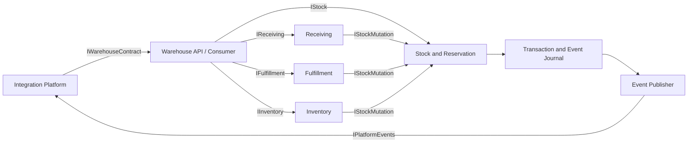
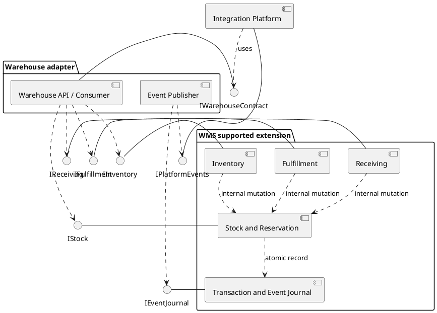

# UML Component: складское приложение и адаптер

| Поле | Значение |
| --- | --- |
| Идентификатор / версия | WH-UML-001 / 1.0 |
| Дата | 04.10.2026 |
| Ответственная группа | Команда 3 — Warehouse |
| Статус | Проект для согласования; не свидетельствует о внедрении |
| Источники | [DOC-05](../../../00_Documentation/DOC-05.md), [DOC-09](../../../00_Documentation/DOC-09.md) |
| Связанные требования | WH-R-01/02/03/09/18 — [каталог](../../01_Business_Architecture/Requirements/WH-REQ-001-requirements.md) |

## Компонентная модель To-Be

Модель детализирует C2 «Приложение WMS» и C4 «Адаптер Warehouse» из [C4](../C4/WH-C4-002-containers.md). Компоненты ниже — логические модули с предоставляемыми/требуемыми интерфейсами; их выделение не означает создание отдельных микросервисов. Набор интерфейсов является проектным.

| Компонент | Предоставляет | Требует |
| --- | --- | --- |
| Warehouse API / Consumer | IWarehouseContract | IStock, IReceiving, IFulfillment, IInventory |
| Stock & Reservation | IStock | IRepository, IAudit, IEventJournal |
| Receiving | IReceiving | IStockMutation, IRepository, IEventJournal |
| Fulfillment | IFulfillment | IStockMutation, IRepository, IEventJournal |
| Inventory | IInventory | IStockMutation, IAudit, IRepository |
| Event Publisher | IPublishWarehouseEvents | IEventJournal, IPlatformEvents |
| Integration Platform (внешняя) | IPlatformEvents | IWarehouseContract |

Все операции изменения запаса реализуются одним внутренним модулем WMS; интерфейс IStockMutation не публикуется для соседних систем.

Mermaid выше — обзор зависимостей. Ниже находится исходное представление UML Component в PlantUML, включённое в Markdown; GitHub показывает его как текст, а не как автоматически отрисованную UML-диаграмму.

Принципы модели: бизнес-правила не дублируются в адаптере; publisher читает устойчивый журнал, а не угадывает факт по ответу клиента; права и аудит применяются внутри WMS независимо от входного клиента.

[К содержанию Warehouse](../../README.md)
