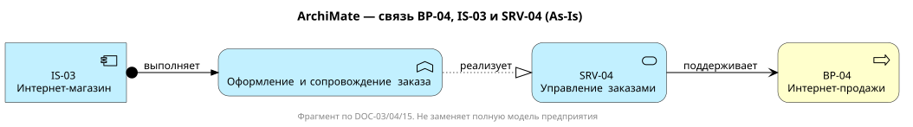

# Связь интернет-продаж с ArchiMate As-Is

Фрагмент связывает приложение IS-03, функцию оформления заказа, сервис SRV-04 и бизнес-процесс BP-04 по DOC-03/04/15.

[Исходник PlantUML](AM-EC-001-application-bridge.puml) · [SVG](AM-EC-001-application-bridge.svg) · [Трассируемость и допущения](../../02_Application_Architecture/APP-EC-001-as-is.md)

