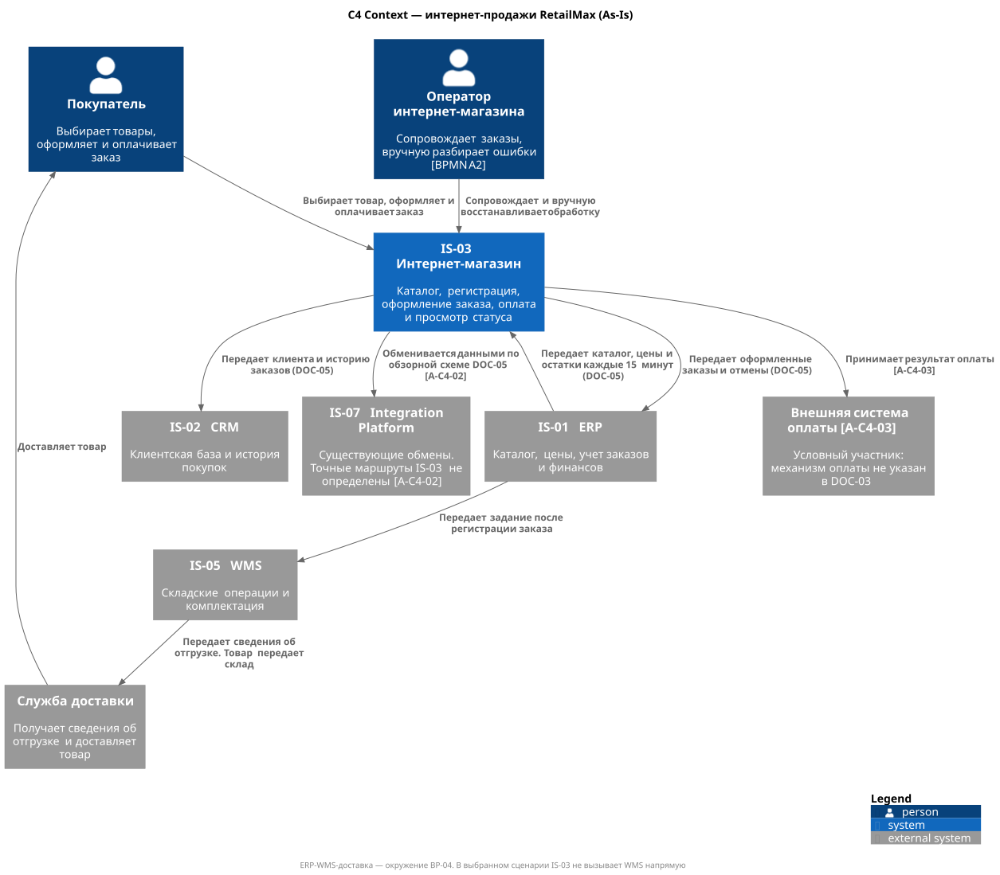
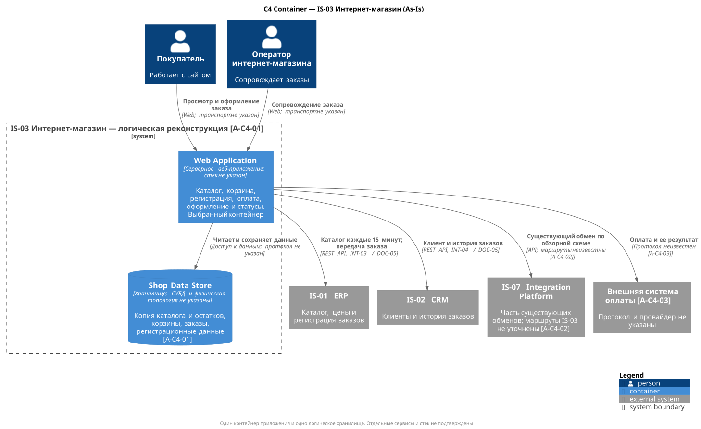

# C4 интернет-магазина RetailMax As-Is

Модели описывают IS-03 «Интернет-магазин» для процесса BP-04. Подробные источники, ограничения и связь с BPMN приведены в [APP-EC-001](../../02_Application_Architecture/APP-EC-001-as-is.md).

## Context

[Исходник PlantUML](C4-EC-001-context.puml) · [SVG](C4-EC-001-context.svg)

## Container

[Исходник PlantUML](C4-EC-002-container.puml) · [SVG](C4-EC-002-container.svg)

Внутренние контейнеры представлены как логическая реконструкция As-Is. Технологический стек и физическая топология не указаны в учебных источниках.
