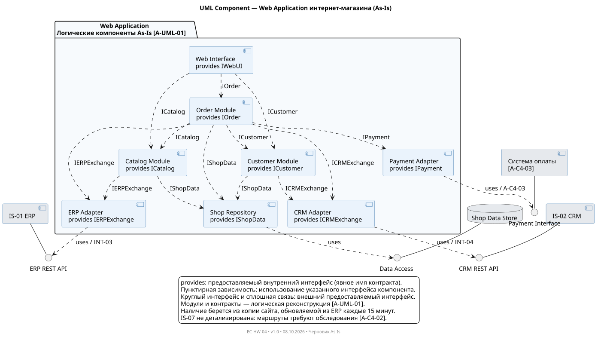
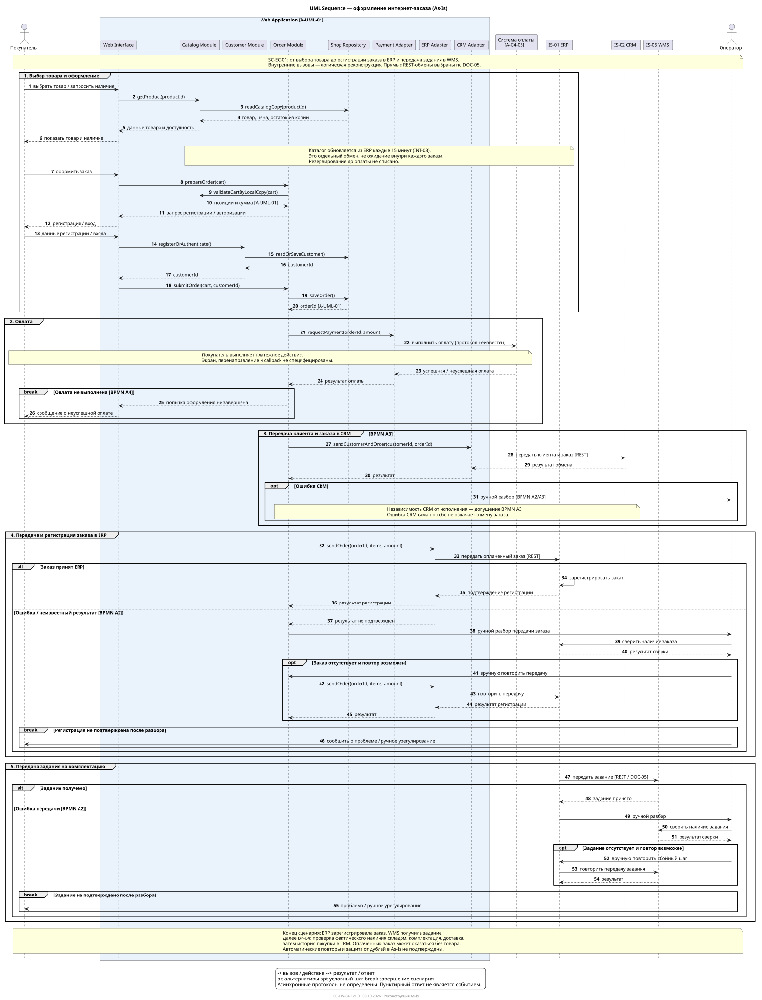

# UML интернет-магазина RetailMax As-Is

Выбранный контейнер — Web Application. Бизнес-сценарий SC-EC-01 охватывает оформление и оплату заказа, его регистрацию в ERP и передачу задания в WMS. Связь с существующей BPMN и допущения приведены в [APP-EC-001](../../02_Application_Architecture/APP-EC-001-as-is.md).

## Component

[Исходник PlantUML](UML-EC-001-order-components.puml) · [SVG](UML-EC-001-order-components.svg)

## Sequence

[Исходник PlantUML](UML-EC-002-checkout-sequence.puml) · [SVG в полном размере](UML-EC-002-checkout-sequence.svg)

Названия внутренних модулей и операций — функциональная реконструкция. Автоматические повторы, резервирование до оплаты и событийная архитектура в As-Is не подтверждены.
